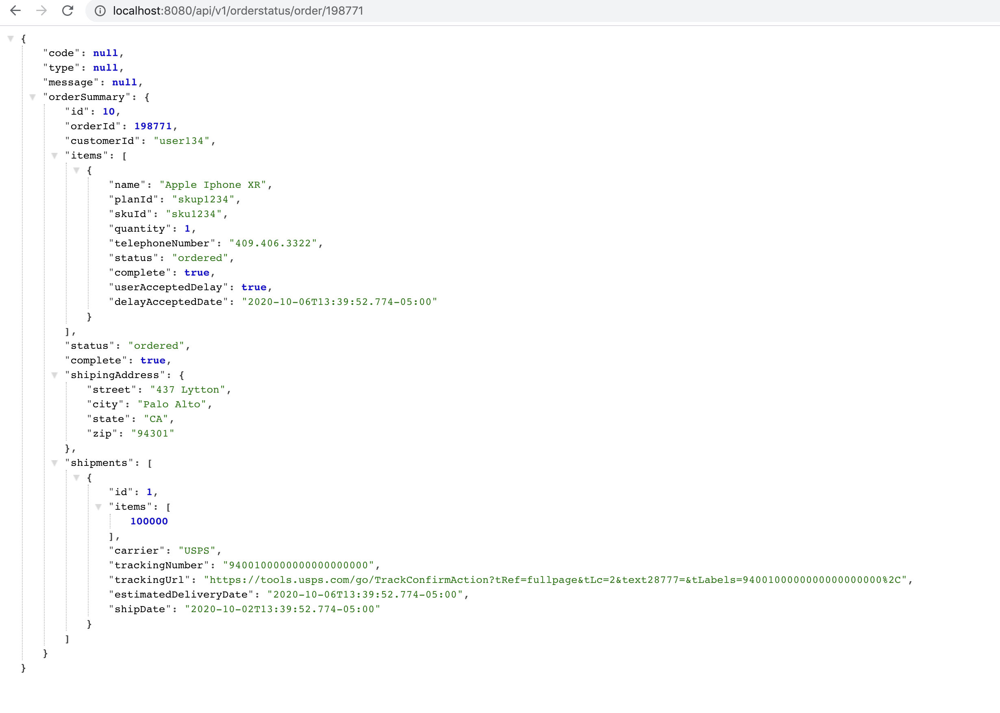

## Pre-requisite:
==============
Install the below things before running the app:

* 1. jdk8
* 2. maven
* 3. wiremock 2.24.1

## Steps to run the application:
=============================
* 1. mvn clean install the app
* 2. java -jar <above_created_jar>

The application will run on port http://localhost:8080/api/v1/orderstatus/order/{orderId}.
The wiremock server will run on 8090.
Sample OrderIds used are : 198771 and 198772
Rest Api Exposed : 
"http://localhost:8080/api/v1/orderstatus/order/198771"
"http://localhost:8080/api/v1/orderstatus/order/198771"

## Note:  if u want to run this jar as docker then follow below instructions:

* 1. docker build -f Dockerfile -t <image_name>
* 2. docker run <image_name>

## Sample Output Screenshot
